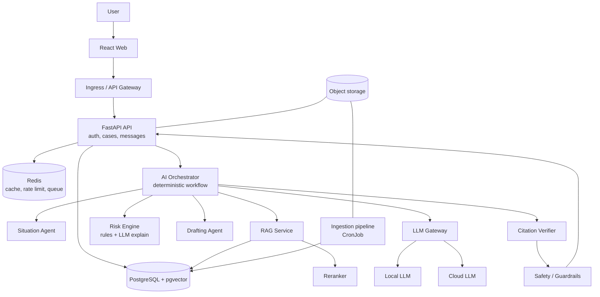
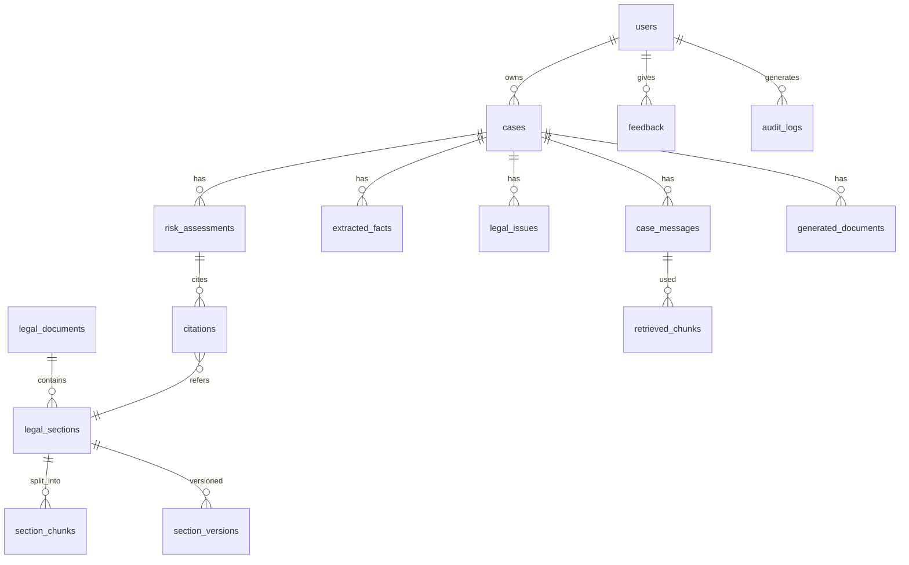

# NyayaSetu — Architecture & Getting-Started Guide

*Name = "bridge to justice". Change freely.*

## 1. Executive summary

Users describe a legal problem in plain language. The system extracts facts, finds the relevant Indian law from a **versioned, verified knowledge base**, explains why provisions may apply, rates legal risk, suggests safer alternatives, and drafts structured outlines, all with citations that are **checked by code, not trusted from the LLM**. It is legal information and decision support, never a lawyer.

**Core design rule:** LLMs read, summarise and explain. Deterministic code decides which laws exist, which are in force, and which citations are allowed.

## 2. System architecture



## 3. Agents: what to build (and what not to)

| Component | Type | MVP? |
| --- | --- | --- |
| Intake / jurisdiction detection | Deterministic + small LLM | Yes |
| Situation Understanding | LLM (structured output) | Yes |
| Legal Issue Classifier | Small LLM / fine-tuned classifier | Yes |
| Retrieval | **Code** (not an agent) | Yes |
| Section Mapping | LLM over retrieved chunks only | Yes |
| Risk Engine | **Rules table + LLM explanation** | Yes |
| Approach / Evidence / Argument | One "Guidance Agent", prompt per section | Yes |
| Drafting | LLM + templates | Phase 2 |
| Citation Verification | **Pure code** | Yes |
| Safety / Compliance | Rules + classifier | Yes |

Orchestrator = a plain async state machine (steps, retries, timeouts), not an autonomous agent. Shared state = a `CaseState` Pydantic object persisted per step. Add LangGraph only if branching grows.

## 4. RAG pipeline

Query → language detect → rewrite + decompose → issue classify → **metadata filter** (jurisdiction, in-force date, domain) → hybrid search (pgvector top 30 + Postgres FTS/BM25 top 30) → reciprocal rank fusion → cross-encoder rerank → top 6–8 → context assembly (each chunk tagged `[S1]`…) → LLM generates JSON citing only `[S#]` IDs → verifier → grounding check.

- **Chunking:** by legal structure (Act → Chapter → Section → Sub-section); one section = one chunk, long ones split by sub-section, each chunk carrying a header like "Act | Section | Jurisdiction".
- **Embeddings:** multilingual open model (e.g. BGE-M3 / multilingual-e5). **Reranker:** bge-reranker class.
- **Thresholds:** if best rerank score \< threshold → abstain and ask follow-ups.
- **Multi-hop:** second retrieval pass for definitions, exceptions, and cross-referenced sections.
- **Hallucination prevention:** LLM may cite only retrieved IDs; verifier checks each against DB; unsupported claims are removed or marked uncertain.

## 5. LLM gateway and routing

Single `LLMClient` interface → providers (local via vLLM/Ollama, cloud via adapter). Routing rules (config, not code):

- PII-heavy or user opted "private mode" → local only.
- Classification, extraction, translation checks → small local model.
- Complex reasoning, long context → cloud model (PII redacted first).
- Failure → fallback to the other; if both fail → return retrieved sources with "analysis unavailable".
- Embeddings and reranking are always dedicated local models.

Local: Llama-3.x / Qwen2.5 / Gemma class (7–14B quantised for MVP). Cloud: any frontier model behind the adapter.

## 6. Risk engine

Input: facts + proposed action + retrieved provisions + jurisdiction. A curated **`risk_rules` table** maps (action pattern, domain) → candidate provisions, conditions and baseline severity (written/reviewed by a lawyer). The LLM only (a) checks which conditions the facts satisfy and (b) explains in plain language. Output: provision, conditions met/unmet, risk level (Low/Moderate/High/Critical), safer alternative, confidence, source ID. Critical risk or criminal exposure → `professional_help_required = true`.

## 7. Database (PostgreSQL + pgvector)



Key columns on `legal_sections`/versions: `act_id, section_no, jurisdiction (IN | state code), effective_from, repealed_on, version, source_url, authority, domain, checksum`. `section_chunks.embedding vector(1024)` with HNSW index, plus GIN on `tsvector`, plus btree on `(jurisdiction, effective_from, repealed_on)`. Amendments = new version row; old rows are never deleted. Use row-level security on user-owned tables.

## 8. Ingestion pipeline

Official source (India Code, egazette, state portals, indiankanoon/SCI for judgments later) → collector (scheduled) → dedupe by checksum → PDF/HTML parse → OCR only if no text layer (Tesseract/PaddleOCR) → clean → structure extraction (regex for "Section N." patterns, validated by sample review) → metadata → chunk → embed → upsert as new version → validation checks (section count, sample spot-check) → publish. Repealed/replaced laws (e.g. IPC → BNS) are linked via `supersedes` so the system explains both. Conflicts: prefer higher authority/central vs state per subject list, otherwise flag uncertainty. MVP: manually curate 5–6 domains.

## 9. Response contract (improved)

```json
{
  "schema_version": "1.0",
  "case_id": "uuid",
  "language": "en",
  "situation_summary": "",
  "extracted_facts": [{"id": "F1", "text": "", "confidence": 0.9}],
  "jurisdiction": {"value": "IN-TG", "confidence": 0.7, "assumed": true},
  "legal_issues": [{"id": "I1", "name": "", "rank": 1}],
  "applicable_laws": [{
    "tier": "primary|supporting|possible|not_applicable",
    "act": "", "section": "", "version_effective_from": "",
    "why_applies": "", "supporting_fact_ids": ["F1"],
    "conditions": [], "exceptions": [],
    "source_id": "S1", "confidence": "high|medium|low"
  }],
  "potential_violations": [{"action": "", "provision_source_id": "S2", "risk_level": "moderate", "reasoning": ""}],
  "overall_risk_level": "moderate",
  "safer_alternatives": [],
  "recommended_approach": [{"step": "", "when": "", "documents": [], "avoid": []}],
  "evidence": [{"item": "", "why": ""}],
  "argument_framework": [],
  "citations": [{"id": "S1", "act": "", "section": "", "url": "", "verified": true, "retrieved_at": ""}],
  "follow_up_questions": [],
  "uncertainties": [],
  "professional_help_required": false,
  "disclaimer_id": "info-not-advice-v1"
}
```

## 10. Security and privacy

Auth: OIDC (Keycloak or managed) + short-lived JWT, refresh in httpOnly cookie; RBAC (user, ngo_member, lawyer, admin). TLS everywhere, Postgres disk encryption + field-level encryption for message bodies, secrets via Kubernetes Secrets (+ External Secrets/Vault later). Redis rate limiting per user/IP. Prompt-injection defence: retrieved text and uploaded docs are wrapped as untrusted data, never as instructions; output must match JSON schema; no tools with side effects. RAG poisoning: only whitelisted sources, checksummed, admin-approved publishes. PII: detect/redact before cloud calls, retention default 30 days with one-click delete, audit logs without message content, no training on user data.

## 11. Observability

OpenTelemetry (traces across API → orchestrator → RAG → LLM), Prometheus + Grafana (latency, tokens, cost, error rates), Loki for logs. Custom metrics: retrieval score distribution, citation-failure rate, abstention rate, fallback rate. Langfuse (optional) for prompt/trace review.

## 12. Evaluation

Build a **golden set of 200+ scenarios** (lawyer-reviewed): situation, jurisdiction, correct sections, distractor sections, expected reasoning, abstain-expected flag. Metrics: Recall@K, Precision@K, MRR, NDCG for retrieval; faithfulness, citation accuracy/completeness, hallucination rate, abstention accuracy for generation. Run in CI (RAGAS / custom scripts); block merges when citation accuracy drops below threshold.

## 13. Multilingual

Detect language (fastText/lingua) → keep original → translate to English for retrieval *only if* the multilingual embedding underperforms → answer in user language with section numbers, Act names and a glossary of legal terms kept untranslated. Back-translate key fields to verify. MVP: English + Hindi + Telugu.

## 14. Failure handling

| Situation | Behaviour |
| --- | --- |
| No relevant law / low score | Abstain, ask follow-ups, suggest legal aid (NALSA/DLSA) |
| Conflicting laws | Show both, flag uncertainty, escalate |
| Outdated law | Verifier blocks; show current version |
| Jurisdiction unclear | Ask; otherwise show central law and say so |
| LLM / local / cloud down | Route to other; else sources-only mode |
| DB down | Health check fails, 503 with retry; no answers without sources |
| Prohibited request (evidence tampering, harassment) | Refuse, offer lawful alternative |
| Injection in retrieved doc | Stripped/neutralised, logged, doc quarantined |

## 15. Kubernetes (keep MVP small)

Deployments: `web`, `api`, `orchestrator` (can merge with api in MVP), `rag` (merge in MVP), `llm-gateway`, `worker`. Local LLM server: Deployment on a GPU node. `postgres`: use a managed DB or operator (CloudNativePG); StatefulSet only if self-hosted. `redis`: single StatefulSet. CronJob: ingestion. Job: DB migrations. Ingress + cert-manager. HPA on api/worker. ConfigMap for routing rules, Secrets for keys. Namespaces: `staging`, `prod`.

## 16. Podman and CI/CD

- Multi-stage Containerfiles, non-root user, slim base, rootless Podman locally; `podman compose` (or `podman play kube`) for dev.
- GitHub Actions: **PR** → ruff, mypy, pytest unit → integration (Postgres service) → RAG eval (small golden subset) → Trivy/pip-audit/CodeQL/gitleaks → **main** → build with Podman/Buildah → scan → push to GHCR → deploy staging (Helm/Kustomize) → smoke tests → manual approval → prod (canary 10% → 100%, rollback via `helm rollback`).

## 17. API (v1)

| Method | Path | Purpose |
| --- | --- | --- |
| POST | /api/v1/auth/login, /refresh | Auth |
| POST | /api/v1/cases | Create case (optional first message) |
| GET | /api/v1/cases, /cases/{id} | List / fetch |
| POST | /api/v1/cases/{id}/messages | Send message → starts analysis |
| GET | /api/v1/cases/{id}/analysis/{run_id} | Poll / SSE stream result |
| POST | /api/v1/cases/{id}/documents/draft | Generate draft |
| POST | /api/v1/cases/{id}/evidence | Upload evidence |
| GET | /api/v1/legal/sources, /legal/sections/{id} | Browse sources |
| POST | /api/v1/feedback | Feedback |
| DELETE | /api/v1/cases/{id} | User-controlled deletion |

Example: `POST /api/v1/cases/{id}/messages` with `{"text": "My landlord is refusing to return my security deposit.", "language": "en"}` → `202 {"run_id": "…"}`; stream or poll returns the response contract above.

## 18. Deposit-refund request flow

1. React posts message → FastAPI validates JWT, rate-limits, saves message.
2. Orchestrator starts run; PII scan.
3. Situation agent: parties (tenant, landlord), event (deposit not returned), missing: state, lease, dates, deductions claimed.
4. Classifier: tenancy/security deposit (rank 1), contract, consumer? (low).
5. Not enough info (state, lease, vacate date) → returns follow-up questions; user answers.
6. Retrieval with filters (jurisdiction = user's state, in force today) → rerank → state rent-control law, Transfer of Property Act, Indian Contract Act, notice procedure, consumer/civil routes.
7. Section mapping → tiers; risk engine checks the user's planned actions.
8. Guidance: demand letter → legal notice → rent authority/civil court/mediation; evidence: lease, payment proof, handover photos, messages.
9. Citation verifier + safety → JSON saved to Postgres → React renders.

## 19. MVP vs future

**MVP (3–4 months):** React, FastAPI, Postgres+pgvector, Redis, one local + one cloud LLM, 5–6 legal domains (tenancy, employment/wages, consumer, privacy/IT, small business), English + Hindi/Telugu later, 4 agents + deterministic verifier, Podman, Actions, small K8s cluster. **Future:** lawyer marketplace, mobile app, 10 languages, case-law retrieval, NGO dashboards, enterprise/on-prem, advanced routing, analytics.

## 20. Tech stack

| Tech | Why | When | Alternative |
| --- | --- | --- | --- |
| React + TypeScript + Vite, TanStack Query, Zustand, Tailwind | UI/state/API | MVP | Next.js |
| FastAPI, Pydantic, SQLAlchemy 2 async, Alembic | API + ORM | MVP | Django |
| PostgreSQL + pgvector (HNSW) + FTS | Data + hybrid search | MVP | Qdrant/OpenSearch later |
| Redis | Cache, rate limit, queue | MVP | Valkey |
| arq / Celery | Background jobs | MVP | RabbitMQ/Kafka later |
| MinIO / S3 | Documents | MVP | Cloud object store |
| Keycloak / Auth provider | Auth | MVP | Auth0, Cognito |
| vLLM / Ollama | Local inference | MVP | llama.cpp |
| LiteLLM or own adapter | LLM gateway | MVP | Portkey |
| BGE-M3 + bge-reranker | Embeddings/rerank | MVP | Cohere/Voyage |
| Tesseract / PaddleOCR | OCR | Phase 2 | Cloud OCR |
| OpenTelemetry, Prometheus, Grafana, Loki | Observability | MVP basic | Datadog |
| Trivy, gitleaks, CodeQL, pip-audit | Security scans | MVP | Snyk |
| Unleash / env flags | Feature flags | Later | LaunchDarkly |
| Langfuse + RAGAS | Prompt tracing, eval | MVP-lite | Promptfoo |
| Nginx/Traefik Ingress | Gateway | MVP | Kong |

Skip for MVP: Kafka, service mesh, separate vector DB, LangChain-heavy abstractions.

## 21. Monorepo

```
nyayasetu/
├── apps/web/                 # React + TS
│   └── src/{pages,components,features/{chat,case,sources,risk,drafts},api,store,hooks,i18n}
├── apps/mobile/              # later (React Native)
├── services/
│   ├── api/app/{api/v1,core,models,schemas,services,repositories,security,main.py}
│   ├── orchestrator/{workflow,agents,state}
│   ├── rag/{retrieval,rerank,context,verify}
│   ├── llm_gateway/{providers,routing}
│   ├── risk_engine/{rules,evaluator}
│   ├── ingestion/{collectors,parsers,structure,chunking,embedding,validation}
│   └── workers/
├── packages/{shared-types,api-client,ui}
├── infrastructure/{podman,kubernetes/{base,overlays},github-actions}
├── evaluation/{golden_set,metrics,runners}
├── data/{raw,processed}      # gitignored
├── docs/
└── README.md
```

Backend: share a `libs/` folder of schemas if services split; for MVP, run api + orchestrator + rag as one deployable with clear module boundaries.

## 22. Roadmap

| Phase | Weeks | Deliverable |
| --- | --- | --- |
| 1 Foundation | 1–3 | Monorepo, Podman dev env, FastAPI skeleton, DB schema, CI |
| 2 Ingestion | 3–7 | Ingest 5–6 domains with versions/metadata |
| 3 RAG | 6–10 | Hybrid retrieval + rerank + citation verifier |
| 4 Agents | 9–12 | Orchestrator, situation + classifier + guidance |
| 5 Risk engine | 11–14 | Rules table (lawyer-reviewed), explanations |
| 6 Frontend | 8–15 | Chat, case workspace, sources, risk UI |
| 7 Security | 14–16 | Auth, encryption, redaction, audit |
| 8 Evaluation | 10–17 | Golden set, CI gates |
| 9 Deployment | 16–18 | K8s staging/prod, observability |
| 10 Pilot | 18–24 | NGO / legal-aid / university pilot |
| Team: 2 full-stack, 1 AI/RAG engineer, 1 DevOps (part-time), 1 legal advisor (essential), 1 designer (part-time). |  |  |

## 23. Scale and cost

Cache embeddings and frequent answers in Redis; route to local models by default; send cloud only for hard reasoning; limit context to the top chunks; batch ingestion off-peak; autoscale workers; start with one GPU node. Scale reads with Postgres replicas; move to a dedicated vector DB only when chunk count and latency demand it.

## 24. Startup and impact

Free tier for citizens; NGOs, legal-aid clinics and universities as partners (CSR/grant funded); paid B2B for HR/compliance, SMEs and law firms; later lawyer referrals. Defensible assets: curated, versioned Indian legal data, lawyer-reviewed risk rules, evaluation benchmark, trust.

## 25. First steps (this week)

1. Pick **one** domain first (tenancy or wages) and 2 states.
2. Create the repo, `docker/podman compose` with Postgres+pgvector and Redis.
3. Download \~20 core Acts from India Code; write a parser for section structure; load into `legal_sections`.
4. Embed and test retrieval on 30 hand-written questions; measure Recall@5.
5. Add the citation verifier (code provided) as the final gate.
6. Only then add LLM generation, then the UI.
7. Get a lawyer to review the first 50 scenarios.

## 26. Starter commands

```bash
mkdir nyayasetu && cd nyayasetu && git init
python -m venv .venv && source .venv/bin/activate
pip install fastapi uvicorn[standard] "sqlalchemy[asyncio]" asyncpg alembic pydantic-settings pgvector pytest ruff mypy
podman run -d --name pg -e POSTGRES_PASSWORD=dev -p 5432:5432 docker.io/pgvector/pgvector:pg16
podman run -d --name redis -p 6379:6379 docker.io/library/redis:7
npm create vite@latest apps/web -- --template react-ts
```

Minimal FastAPI entry (`services/api/app/main.py`):

```python
import logging
from fastapi import FastAPI

logger = logging.getLogger(__name__)
app = FastAPI(title="NyayaSetu", version="0.1.0")

@app.get("/api/v1/health")
async def health() -> dict[str, str]:
    return {"status": "ok"}
```

Sample Containerfile:

```dockerfile
FROM python:3.12-slim AS build
WORKDIR /app
COPY requirements.txt .
RUN pip install --no-cache-dir --prefix=/install -r requirements.txt
FROM python:3.12-slim
RUN useradd -m app
COPY --from=build /install /usr/local
COPY app /app/app
USER app
WORKDIR /app
CMD ["uvicorn", "app.main:app", "--host", "0.0.0.0", "--port", "8000"]
```

GitHub Actions skeleton (`.github/workflows/ci.yml`):

```yaml
name: ci
on: [pull_request]
jobs:
  test:
    runs-on: ubuntu-latest
    services:
      postgres:
        image: pgvector/pgvector:pg16
        env: { POSTGRES_PASSWORD: test }
        ports: ["5432:5432"]
    steps:
      - uses: actions/checkout@v4
      - uses: actions/setup-python@v5
        with: { python-version: "3.12" }
      - run: pip install -r requirements.txt ruff mypy pytest
      - run: ruff check . && mypy . && pytest
      - uses: aquasecurity/trivy-action@master
        with: { scan-type: fs }
```

Attached: `citation_verifier.py` + `test_citation_verifier.py`, the first production module (run `pytest`).

*Legal note: have a qualified Indian lawyer review the risk rules, disclaimers, and data-protection (DPDP Act) compliance before launch.*